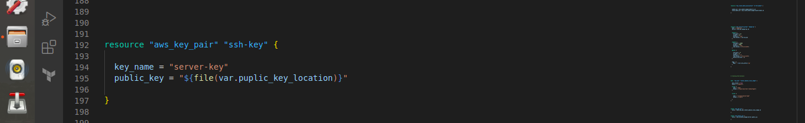

# Automate-AWS-Infrastructure-Project-using-Terraform

The Project Goal here is :

Using Terraform to provision AWS Infrastructure to :

Prevision an aws-ec2 instance on aws infrastructure.
Run nginx docker container on ec2-instance.

First
we have to provision aws infrastructure to do that using Terraform
We must add these resources to our .tf file
Steps :

Add AWS Provider

Create custom vpc.

Create a custom subnet.

Carete cidr blocks ( VPC & Subnet).

cidr block will be referenced from the tf.vars file and and
be added as  ( cidr_block = var.subnet_cidr_blocks ) and   cidr_block = var.vpc_cidr_blocks
into both vpc and subnet resources

Create route table and internet gateway provision ec2 instance.  

and must associate created subnet with the route table created

Create a security group.

-----------------------------------------------------------------------------------------------------------------------------------------------------------

Second :
Provision ec2 instance :

We must add these resources to our .tf file

1 - Create a key pair for ssh into instance.

server-key.pub file is refrenced from the .tfvars file

2- Fetch and filter the desired os image we want to run on the server

3- Create EC2-Instance resource

Final step :

1 - Run initial commands to run an nginx container on ec2-server

We create a entry-server.sh file and reference it into our ec2 instance resource by adding user_data attribute

all used varabiles are defined in the .tf file

Both AWS_ACCESS_KEY anad AWS_SECRET_ACCESS_KEY ( AWS CRedinaltis)
was defined as environmental  variables 

